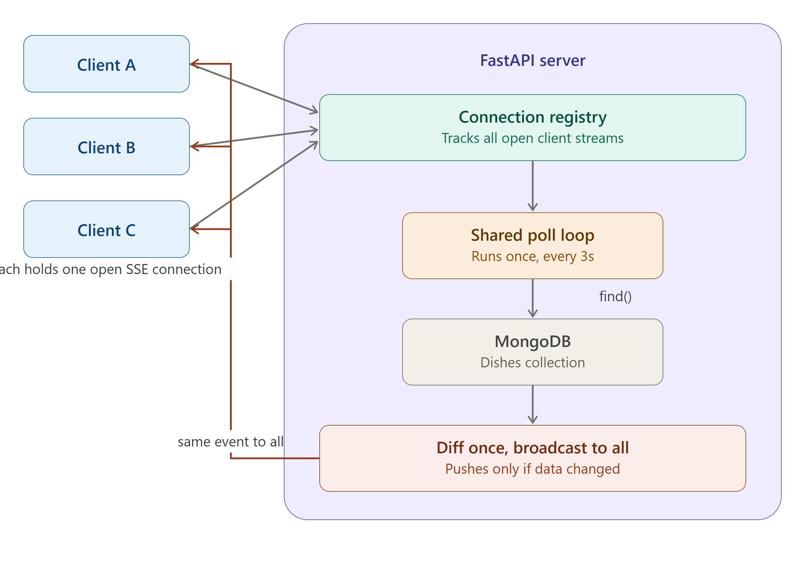

# 🍽️ Dish Management Dashboard

A full-stack web application to manage and display dish information. View dishes, toggle their published status, and see changes reflected in real-time across all connected clients — no page refresh needed.

---

## 🚀 Features

- **View Dishes** — Responsive grid of dishes fetched from a MongoDB database.
- **Toggle Status** — Instantly publish or unpublish any dish with one click.
- **Real-Time Updates (SSE)** — Hybrid Real-Time Architecture: if a dish is modified directly in the database (e.g., via MongoDB Compass), the dashboard updates immediately.

---

## 🏗️ Architecture

This project uses a **Hybrid Server-Side Polling + Server-Sent Events (SSE)** architecture — database-agnostic, real-time updates with low network traffic.



---

## 💻 Tech Stack

**Frontend**
- React.js (Vite)
- Tailwind CSS
- HTML5 Server-Sent Events (`EventSource` API)

**Backend**
- Python 3
- FastAPI
- PyMongo
- Uvicorn (ASGI server)
- `asyncio` for non-blocking background tasks

**Database**
- MongoDB (Atlas Cloud or Local)

---

## 📁 Project Structure

```
dish-dashboard/
├── backend/
│   ├── .env          # Environment variables (Database URL)
│   └── main.py       # API endpoints and SSE logic
├── public/           # Vite public assets
├── src/
│   ├── App.jsx       # Main dashboard and SSE listener
│   ├── DishCard.jsx  # Reusable UI component
│   └── index.css     # Tailwind directives
├── package.json
└── tailwind.config.js
```

---

## 🛠️ Getting Started

You will need **Node.js** and **Python 3** installed. Run two terminal windows — one for the backend, one for the frontend.

### 1. Database Setup

1. Create a free [MongoDB Atlas](https://www.mongodb.com/atlas) cluster or run MongoDB locally.
2. Copy your connection string URL.

---

### 2. Backend Setup (Terminal 1)

```bash
cd backend
python -m venv venv

# Activate virtual environment
# Windows:
venv\Scripts\activate
# Mac/Linux:
source venv/bin/activate

# Install dependencies
pip install fastapi uvicorn pymongo python-dotenv

# Create your environment file
echo MONGO_URL="your_mongodb_connection_string_here" > .env

# Start the server
uvicorn main:app --reload
```

The backend runs at `http://127.0.0.1:8000`.  
On first run, it automatically connects to MongoDB and seeds the database with initial dish data.

---

### 3. Frontend Setup (Terminal 2)

```bash
# From the root dish-dashboard/ directory

# Install Node modules
npm install

# Start the development server
npm run dev
```

The frontend runs at `http://localhost:5173`. Open this in your browser to view the dashboard.

---

## 🎥 Demo Videos

| Video | Link |
|-------|------|
| App Demonstration | [Watch Demo](https://drive.google.com/file/d/1ijNiz6SygYNAqWypUwVl3-Eo6ZCKEIly/view?usp=sharing) |
| Code Explanation | [Watch Code Walkthrough](https://drive.google.com/file/d/1kXwhOVwYoAGpkNFqXy3sLqA64eMu0BOz/view?usp=sharing) |
